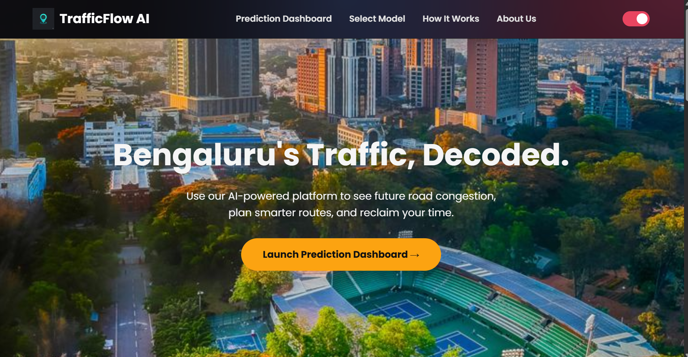
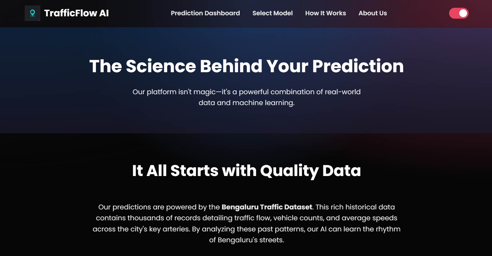
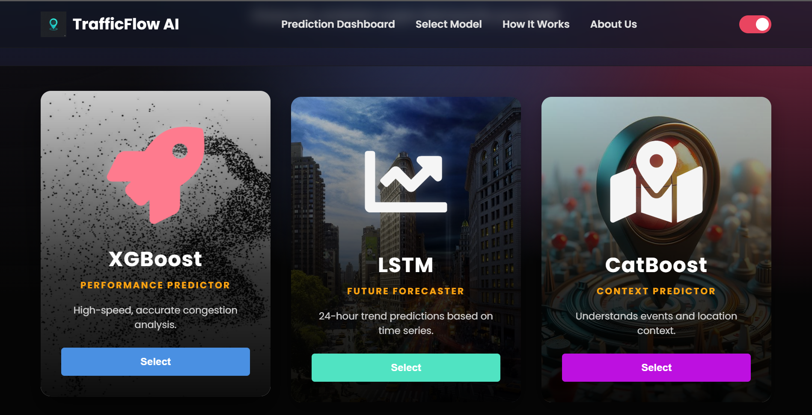
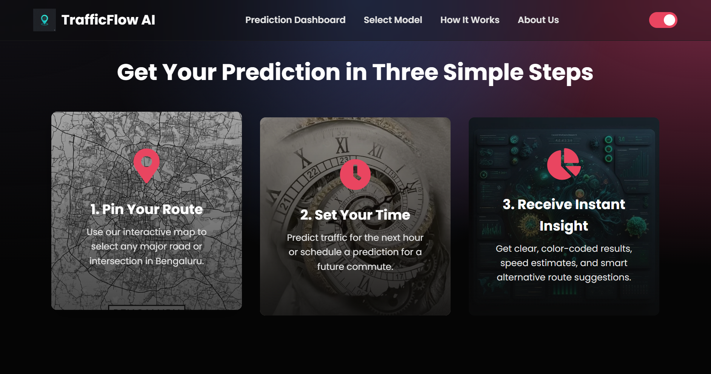

#  TrafficFlow AI | Intelligent Urban Mobility


> **A Microservices-based Machine Learning Platform for Traffic Prediction in Bengaluru.**

---

## 📖 Table of Contents
* [ Overview](#-overview)
* [ Key Features](#-key-features)
* [ The AI Models](#-the-ai-models)
* [ Tech Stack](#-tech-stack)
* [ Architecture](#-architecture)
* [ Screenshots](#-screenshots)
* [ Getting Started](#-getting-started)
* [ The Team](#-the-team)

---

##  Overview

**The Problem:** Urban congestion involves more than just "too many cars." It is a complex interplay of time, weather, events, and road infrastructure. Existing navigation tools often lack the context to explain *why* a jam is happening or *how* it will evolve.

**The Solution:** **TrafficFlow AI** is a next-generation web platform that leverages **six specialized Machine Learning models** to provide granular traffic insights. Unlike monolithic apps, our system uses a distributed **Microservices Architecture**, allowing us to scale different prediction engines independently.

Whether you are a daily commuter needing a quick route or a data analyst studying long-term urban trends, TrafficFlow AI provides the tools to visualize the pulse of the city.

---

##  Key Features

### 🖥️ Two Distinct Dashboards
* **Simple Dashboard:** A streamlined interface for commuters. Select a location -> Get instant speed & congestion predictions.
* **Expert Dashboard:** A deep-dive interface for analysts. Visualize confidence intervals, feature importance, and historical trends.

###  Modern UI/UX
* **Glassmorphism Design:** A stunning, translucent aesthetic.
* **Dynamic Theme:** Seamless Dark/Light mode toggling.
* **Interactive Maps:** Powered by Leaflet.js for precise location selection.
* **Rich Visualizations:** Interactive Line, Bar, and Doughnut charts powered by Chart.js.

---

##  The AI Models

Our "Brain" consists of 6 independent AI Experts:

| Model | Role | Special Power |
| :--- | :--- | :--- |
| **🚀 XGBoost** | **Congestion Level** | Ultra-fast gradient boosting for instant "High/Medium/Low" classification. |
| **🌲 Random Forest** | **Speed Estimator** | Robust ensemble learning to predict precise average vehicle speeds. |
| **🐱 CatBoost** | **Context Aware** | Handles categorical data like *Events* (e.g., "Cricket Match") to predict impact. |
| **📈 LSTM** | **Future Trends** | Deep Learning neural network that forecasts traffic flow for the next 24 hours. |
| **🔍 K-Means** | **Pattern Seeker** | Unsupervised clustering to categorize roads (e.g., "Quiet Street" vs "Busy Hub"). |
| **🤖 Hybrid Ensemble** | **The Orchestrator** | A meta-model that averages predictions from all others for maximum accuracy. |

---

## 🛠️ Tech Stack

### **Frontend**
*  **HTML5 & CSS3** - Structure & Glassmorphism Styling
*  **JavaScript (ES6+)** - Core Application Logic
*  **Leaflet.js** - Interactive Mapping
*  **Chart.js** - Data Visualization
*  **LottieFiles** - Vector Animations

### **Backend & DevOps**
*  **Node.js & Express** - API Gateway
*  **Python 3.11** - ML Microservices
*  **Docker** - Containerization
*  **Render Cloud** - Deployment

---

## 🏗️ Architecture

The system follows a **Microservices Pattern**:

1.  **Frontend:** The user interacts with the UI (Browser).
2.  **API Gateway:** A Node.js server receives the request and routes it to the correct model.
3.  **Model Services:** Independent Python containers (FastAPI/Flask) compute the prediction.
4.  **Response:** The result is sent back up the chain to the user in milliseconds.

---

## 📸 Screenshots

| Landing Page | Expert Dashboard |
|:---:|:---:|
|  |  |

| Model Selection | Dark Mode |
|:---:|:---:|
|  |  |

---

## 🚀 Getting Started

To run the frontend locally:

### Prerequisites
* A modern web browser (Chrome/Edge/Firefox).
* Internet connection (to fetch map tiles and API data).

### Installation
1.  **Clone the Repository**
    ```bash
    git clone [https://github.com/PrajwalShetty-114/Traffic-Flow-Prediction-Frontend.git](https://github.com/PrajwalShetty-114/Traffic-Flow-Prediction-Frontend.git)
    ```

2.  **Navigate to Folder**
    ```bash
    cd trafficflow-frontend
    ```

3.  **Launch**
    * Simply open `index.html` in your browser.
    * *Optional:* Use `Live Server` in VS Code for a better experience.

---

## 👥 The Team

**Group 31 - Final Year Project**
* **Prajwal Shetty** - Full Stack Developer
* **Yogin Kumar** - Full Stack Developer
* **Supriya Poojary** - Full Stack Developer
* **Swayam U Fondekar** - Full Stack Developer


---

<p align="center">
  Built with ❤️ in India | &copy; 2025 TrafficFlow AI
</p>
